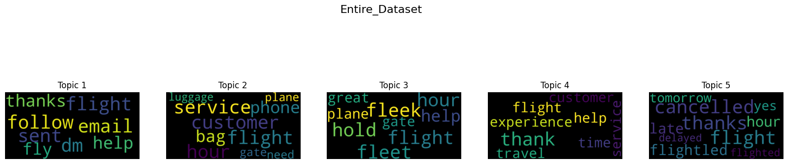
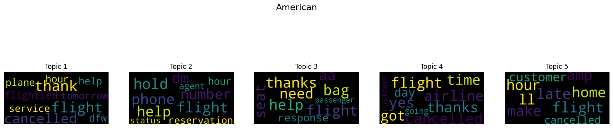

# Twitter Topic Analysis

## Overview
This project aims to analyze tweets to identify prevailing topics discussed in relation to different airlines. Using natural language processing (NLP) techniques, the code preprocesses the data, applies topic modeling using Latent Dirichlet Allocation (LDA), and visualizes the results as word clouds. This helps in understanding customer sentiments and prevalent themes across various airline services.

## Application
The application is structured into several modules:
- **Text Processing**: Cleans and preprocesses the tweet data for analysis.
- **Topic Modeling**: Applies LDA to extract significant topics from the cleaned data.
- **Visualization**: Generates and saves word clouds for each identified topic to visualize the frequency of term occurrence.
- **Main Execution**: Orchestrates the workflow from data loading, processing, modeling, to visualization.

## Goal
The goal of this project is to provide a clear understanding of customer opinions and concerns regarding different airlines, enabling businesses to tailor their strategies and improve customer satisfaction.

## Functions
### 1. `preprocess_dataset(text_data)`
- Cleans the tweet text by removing mentions, converting to lowercase, removing stopwords and punctuation, and applying lemmatization.

### 2. `lda_for_entire_dataset(clean_text)`
- Performs LDA on the entire dataset to determine common topics.

### 3. `lda_for_airline(tweets_df, airline)`
- Filters the dataset for tweets related to a specific airline and performs LDA to find relevant topics.

### 4. `create_word_clouds(entity, topics)`
- Generates word clouds for the topics extracted from the LDA analysis.

## Results
Results include visual word clouds that represent the most frequent and significant terms associated with topics in the tweets. These can be used to quickly gauge public opinion and highlight areas of concern or praise. *(Results to be uploaded later.)*

Below are visual word clouds representing the most frequent and significant terms associated with topics in the tweets. These visuals help to quickly gauge public opinion and highlight areas of concern or praise.

### Entire Dataset


### American Airlines


## Requirements
This project requires Python 3.x and the following packages:
- pandas
- nltk
- scikit-learn
- matplotlib
- wordcloud

You can install these packages using pip:
```bash
pip install pandas nltk scikit-learn matplotlib wordcloud
